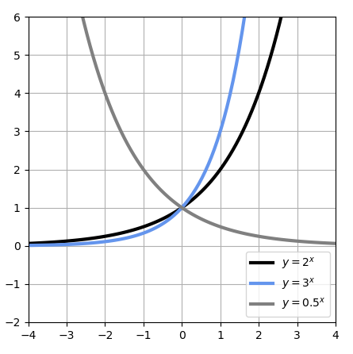
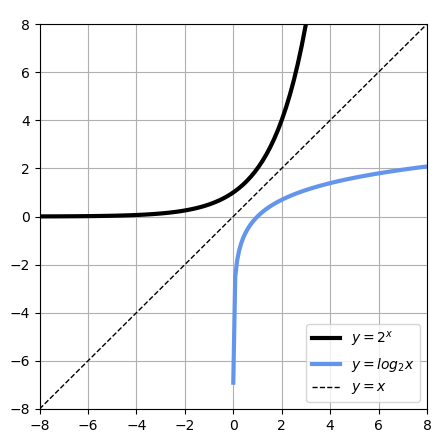
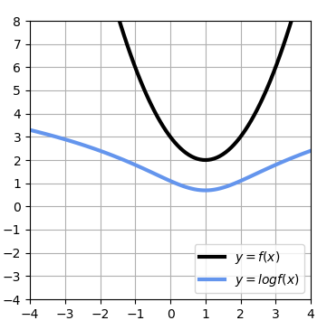
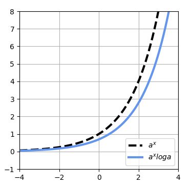
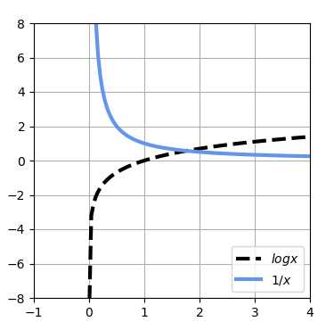
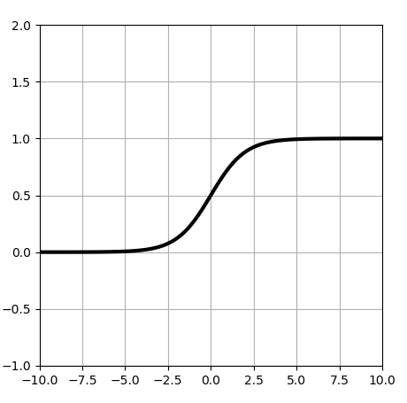
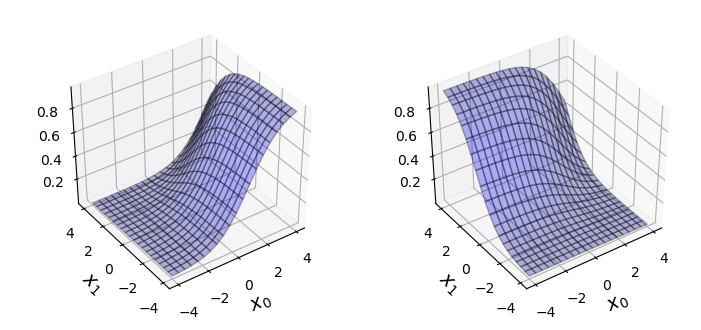

# ExpLogForMachineLearning
---
Python sample programs of Exponential and logarithm for Machine learning.

## Sample 1: plot_exponential_function.py
---
Sample program to plot basic exponential function graph.  
  

## Sample 2: plot_logarithm_function.py
---
Sample program to plot basic logarithm function graph.  
  

## Sample 3: plot_logarithm_argmin.py
---
Sample program to plot min and argmin graph of logarithm function.  
  

## Sample 4: plot_exp_func_differential.py
---
Sample program to plot differential graph of exponential function.  
  

## Sample 5: plot_log_func_differential.py
---
Sample program to plot differential graph of logarithm function.  
  

## Sample 6: plot_sigmoid_function.py
---
Sample program to plot graph of sigmoid function.  
  

## Sample 7: plot_softmax_function.py
---
Sample program to plot softmax function graph.
  